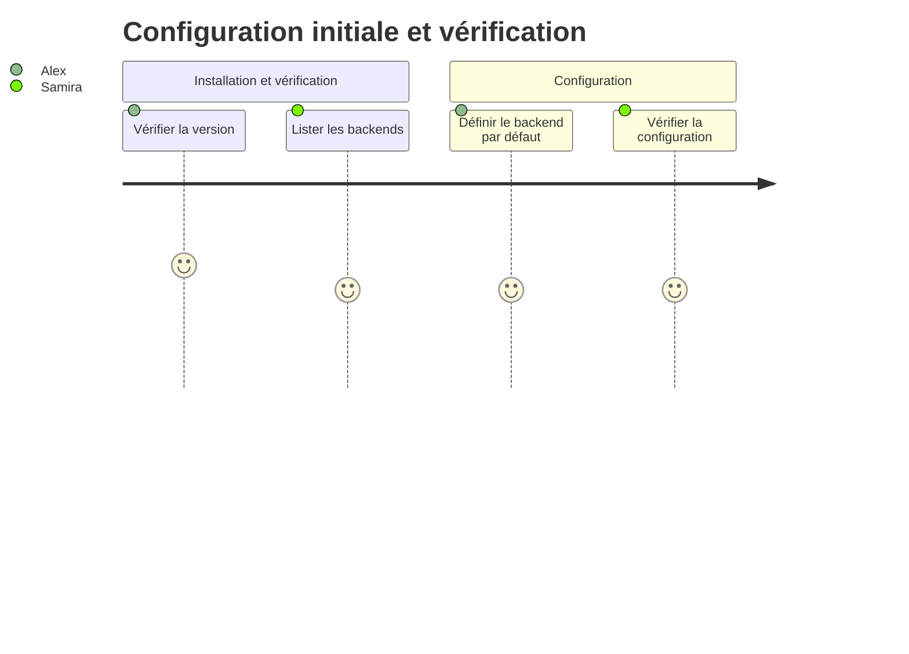
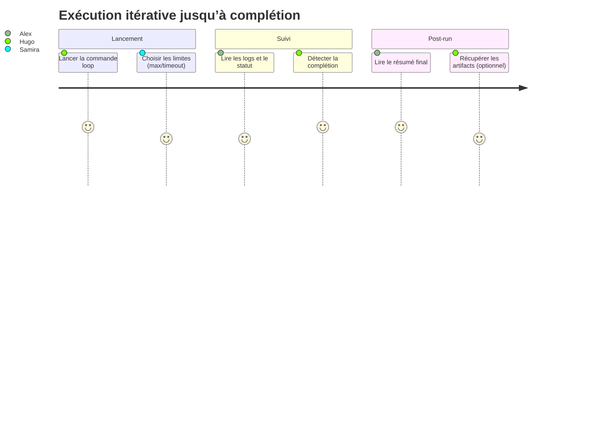
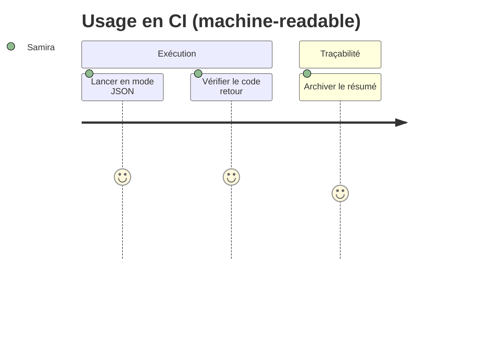

# Personas & Parcours Utilisateurs — `@jlguenego/ai-cli` (CLI : `jlgcli`)

## Personas

### Persona 1 : Alex — Développeur solo « productivité »

| Attribut               | Valeur                                                                          |
| ---------------------- | ------------------------------------------------------------------------------- |
| Rôle                   | Développeur full-stack solo                                                     |
| Âge / Contexte         | 28-38 ans, projets perso / side-projects, temps limité                          |
| Objectifs              | Automatiser scaffolding/refactors, réduire la supervision, enchaîner les tâches |
| Frustrations           | Doit relancer l’IA, découper en micro-étapes, surveiller les runs               |
| Compétences techniques | Avancé (Node, CLI, Git, CI)                                                     |
| Quote typique          | « Je veux lancer une tâche et revenir quand c’est fini. »                       |

### Persona 2 : Samira — Freelance « multi-clients »

| Attribut               | Valeur                                                                                     |
| ---------------------- | ------------------------------------------------------------------------------------------ |
| Rôle                   | Développeuse freelance (missions variées)                                                  |
| Âge / Contexte         | 30-45 ans, alterne entre plusieurs dépôts et environnements client                         |
| Objectifs              | Industrialiser des tâches récurrentes, standardiser l’outil malgré des backends différents |
| Frustrations           | Outils IA hétérogènes, erreurs peu lisibles, temps perdu en “monitoring”                   |
| Compétences techniques | Confirmé (automation, scripts, Windows-first souvent)                                      |
| Quote typique          | « Je veux des logs clairs et des codes retour stables. »                                   |

### Persona 3 : Hugo — Maker « lancer vite »

| Attribut               | Valeur                                                                            |
| ---------------------- | --------------------------------------------------------------------------------- |
| Rôle                   | Maker / porteur de projet                                                         |
| Âge / Contexte         | 22-40 ans, prototypage rapide, itérations fréquentes                              |
| Objectifs              | Itérer vite sur features/docs, limiter le temps passé à piloter l’assistant       |
| Frustrations           | Boucles infinies, sorties non structurées, difficulté à “savoir quand c’est fini” |
| Compétences techniques | Intermédiaire (CLI basique, Git)                                                  |
| Quote typique          | « Donne-moi un résumé final et un transcript si besoin. »                         |

---

## Parcours utilisateurs

### Parcours 1 : « Configurer et vérifier le backend »

#### Contexte

L’utilisateur vient d’installer le package NPM. Il veut vérifier que `jlgcli` est opérationnel et définir un backend par défaut.

#### Étapes

| Étape | Action                                         | Pensée                                        | Émotion  | Opportunité                                 |
| ----- | ---------------------------------------------- | --------------------------------------------- | -------- | ------------------------------------------- |
| 1     | Lance `jlgcli --version`                       | “Ok, ça tourne.”                              | Confiant | Sortie stable + code retour 0               |
| 2     | Lance `jlgcli backends`                        | “Qu’est-ce qui est supporté sur ma machine ?” | Curieux  | Statuts `available/missing/unauthenticated` |
| 3     | Définit le backend par défaut via `config set` | “Je ne veux pas le répéter à chaque fois.”    | Soulagé  | Persistance config locale                   |
| 4     | Vérifie `config get backend`                   | “C’est bien pris en compte ?”                 | Rassuré  | UX simple + output lisible                  |

#### Diagramme de parcours (OBLIGATOIRE)

### Parcours 2 : « Lancer une boucle itérative et récupérer un résumé »

#### Contexte

L’utilisateur veut exécuter une tâche longue (ex. “réorganiser une base de code”, “générer des fichiers”, “rédiger une doc”) en mode “lancer et oublier” avec garde-fous.

#### Étapes

| Étape | Action                                   | Pensée                                              | Émotion   | Opportunité                       |
| ----- | ---------------------------------------- | --------------------------------------------------- | --------- | --------------------------------- |
| 1     | Lance `jlgcli loop ./task.md`            | "Je veux que ça boucle jusqu'à la fin."             | Motivé    | Protocole de complétion explicite |
| 2     | Observe la progression (logs)            | “Est-ce que ça progresse ?”                         | Vigilant  | Indicateurs d’itération + temps   |
| 3     | Le run s’arrête sur `DONE` / JSON `done` | “Parfait, c’est terminé.”                           | Satisfait | Signal de fin robuste             |
| 4     | Consulte le résumé final                 | “Combien d’itérations, quel backend, quel statut ?” | Clair     | Résumé lisible + option `--json`  |
| 5     | (Optionnel) Active `--artifacts`         | “Je veux un transcript exploitable.”                | Rassuré   | Dossier `.jlgcli/runs/<id>/`      |

#### Diagramme de parcours (OBLIGATOIRE)

### Parcours 3 : « Exécution en CI (sortie JSON + codes retour) »

#### Contexte

L’utilisateur souhaite intégrer `jlgcli` dans un script (CI/CD ou automation locale) et dépendre de codes retour et d’une sortie JSON stable.

#### Étapes

| Étape | Action                                 | Pensée                         | Émotion     | Opportunité                |
| ----- | -------------------------------------- | ------------------------------ | ----------- | -------------------------- |
| 1     | Lance `jlgcli run ./prompt.txt --json` | "Je veux parser la sortie."    | Pragmatique | Contrat JSON stable        |
| 2     | Évalue le code retour                  | “Succès / indispo / timeout ?” | Confiant    | Codes de sortie documentés |
| 3     | Archive le résumé                      | “Je garde une trace du run.”   | Serein      | Artifacts + logs contrôlés |

#### Diagramme de parcours (OBLIGATOIRE)

---

## Matrice Personas / Fonctionnalités

| Fonctionnalité                                                   | Alex (solo) | Samira (freelance) | Hugo (maker) |
| ---------------------------------------------------------------- | ----------- | ------------------ | ------------ |
| Sélection du backend + persistance config                        | Must        | Must               | Should       |
| Liste des backends + statuts (available/missing/unauthenticated) | Must        | Must               | Could        |
| `run` one-shot                                                   | Should      | Should             | Must         |
| `loop` itératif (DONE / JSON)                                    | Must        | Must               | Must         |
| Garde-fous (maxIterations/timeout/noProgress)                    | Must        | Must               | Must         |
| Résumé final + `--json`                                          | Must        | Must               | Should       |
| Sauvegarde d’artifacts (`--artifacts`)                           | Should      | Must               | Should       |

---

## Notes de conception issues des personas

- **Contrat de complétion** : Hugo est très sensible au “signal de fin” → le mode JSON doit être encouragé (moins fragile que le marqueur texte), tout en gardant `DONE` pour la simplicité.
- **Fiabilité et traçabilité** : Samira a besoin de codes retour et d’erreurs normalisées → messages clairs, classification (timeout/indispo/erreur backend).
- **UX et vitesse** : Alex veut lancer rapidement → defaults raisonnables (backend par défaut, limites) et commandes ergonomiques.
