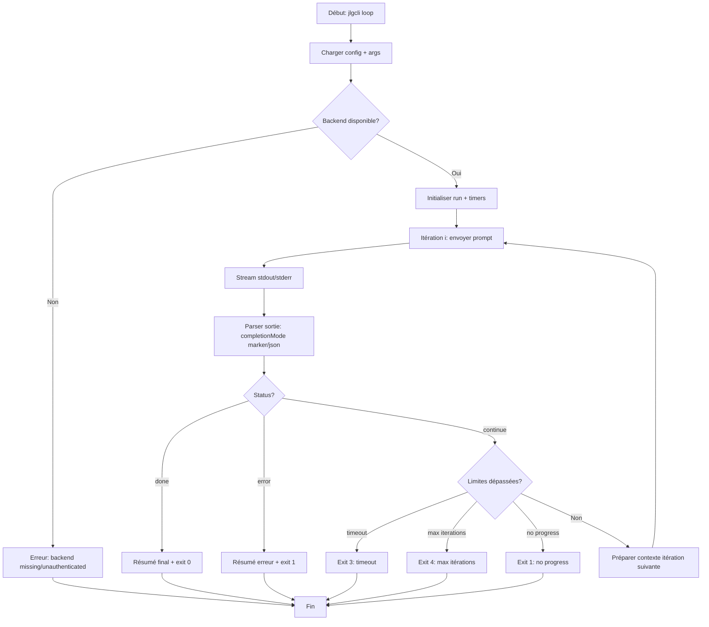
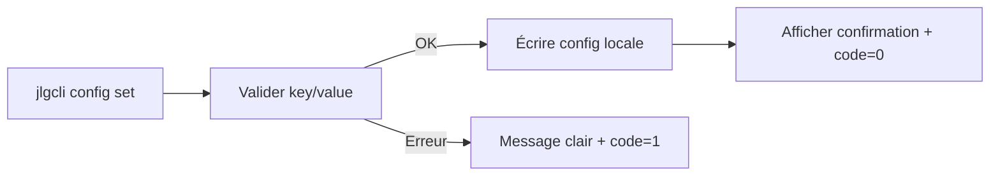

# User Stories & Flux — `@jlguenego/ai-cli` (CLI : `jlgcli`)

## Épopées (Epics)

### Epic 1 : Installation & prise en main

**Objectif** : Permettre à l’utilisateur de vérifier rapidement que `jlgcli` fonctionne.
**Valeur business** : Réduire le friction d’adoption et le temps de “setup”.

### Epic 2 : Configuration & choix du backend

**Objectif** : Permettre de définir un backend par défaut et des limites de sécurité stables.
**Valeur business** : Rendre l’outil utilisable en continu sans répétition ni surprise.

### Epic 3 : Découverte & diagnostic des backends

**Objectif** : Exposer les backends supportés et leur état (disponible/manquant/non-authentifié).
**Valeur business** : Réduire les erreurs et accélérer le troubleshooting.

### Epic 4 : Exécution one-shot

**Objectif** : Lancer un prompt simple sur le backend choisi.
**Valeur business** : Couvrir l’usage basique et fournir une base commune pour la boucle.

### Epic 5 : Exécution itérative (loop) jusqu’à complétion

**Objectif** : Boucler automatiquement tant que l’assistant ne signale pas explicitement la fin.
**Valeur business** : Activer le mode “lancer et oublier” (avec garde-fous).

### Epic 6 : Observabilité & artifacts

**Objectif** : Produire un résumé final et, optionnellement, sauvegarder transcript/logs.
**Valeur business** : Traçabilité (CI), audit, ré-exécution, support.

---

## User Stories

### [EPIC-01] Stories — Installation & prise en main

| ID     | En tant que | Je veux                                                      | Afin de                           | Priorité | Points |
| ------ | ----------- | ------------------------------------------------------------ | --------------------------------- | -------- | ------ |
| US-001 | utilisateur | installer `@jlguenego/ai-cli` et vérifier `jlgcli --version` | valider l’installation rapidement | Must     | 1      |

### Critères d’acceptance

#### US-001 : Vérifier l’installation

**Given** le package est installé
**When** je lance `jlgcli --version`
**Then** une version est affichée et le code retour est 0

---

### [EPIC-02] Stories — Configuration & choix du backend

| ID     | En tant que | Je veux                                                                  | Afin de                                            | Priorité | Points |
| ------ | ----------- | ------------------------------------------------------------------------ | -------------------------------------------------- | -------- | ------ |
| US-002 | utilisateur | configurer un backend par défaut                                         | éviter de le répéter sur chaque commande           | Must     | 2      |
| US-009 | utilisateur | configurer des limites (`maxIterations`, `timeoutMs`, `noProgressLimit`) | éviter les boucles infinies et timeouts silencieux | Must     | 3      |
| US-010 | utilisateur | choisir le mode de complétion (`marker`/`json`)                          | rendre la fin détectable et robuste                | Must     | 2      |

### Critères d’acceptance

#### US-002 : Définir et lire le backend

**Given** aucun backend n’est configuré
**When** je lance `jlgcli config set backend copilot`
**Then** le backend par défaut devient `copilot`

**Given** un backend est configuré
**When** je lance `jlgcli config get backend`
**Then** la valeur renvoyée correspond

#### US-009 : Définir les limites

**Given** je veux encadrer l’exécution
**When** je lance `jlgcli config set maxIterations 20`
**Then** la valeur est persistée et utilisée par défaut

**When** je lance `jlgcli config set timeoutMs 1800000`
**Then** le timeout global est persisté

#### US-010 : Choisir le protocole de complétion

**Given** je souhaite une détection robuste
**When** je lance `jlgcli config set completionMode json`
**Then** `loop` interprète un objet final `{ "status": "done" | "continue" | "error" }`

---

### [EPIC-03] Stories — Découverte & diagnostic

| ID     | En tant que | Je veux                                             | Afin de                                    | Priorité | Points |
| ------ | ----------- | --------------------------------------------------- | ------------------------------------------ | -------- | ------ |
| US-003 | utilisateur | lister les backends supportés et leur disponibilité | diagnostiquer rapidement mon environnement | Must     | 3      |
| US-011 | utilisateur | obtenir ces infos en JSON                           | intégrer facilement en scripts/CI          | Should   | 2      |

### Critères d’acceptance

#### US-003 : Lister les backends

**When** je lance `jlgcli backends`
**Then** je vois la liste des backends supportés
**And** chaque backend affiche un statut `available`/`missing`/`unauthenticated`

#### US-011 : Backends en JSON

**When** je lance `jlgcli backends --json`
**Then** la sortie est un JSON parseable décrivant backends + statut

---

### [EPIC-04] Stories — Exécution one-shot

| ID     | En tant que | Je veux                                          | Afin de                           | Priorité | Points |
| ------ | ----------- | ------------------------------------------------ | --------------------------------- | -------- | ------ |
| US-004 | utilisateur | exécuter un prompt one-shot sur le backend       | obtenir une réponse directement   | Must     | 3      |
| US-012 | utilisateur | surcharger le backend par commande (`--backend`) | tester ou basculer ponctuellement | Should   | 2      |
| US-013 | utilisateur | contrôler la verbosité (`--quiet/--verbose`)     | adapter l’UX (humain vs CI)       | Should   | 2      |

### Critères d’acceptance

#### US-004 : Exécuter un prompt simple

**Given** un backend est sélectionné
**When** je lance `jlgcli run "Explique ce repo"`
**Then** la sortie de l’assistant est imprimée
**And** le code retour est 0 si le backend a réussi

---

### [EPIC-05] Stories — Exécution itérative (loop)

| ID     | En tant que | Je veux                                                          | Afin de                                       | Priorité | Points |
| ------ | ----------- | ---------------------------------------------------------------- | --------------------------------------------- | -------- | ------ |
| US-005 | utilisateur | exécuter une boucle itérative jusqu’à complétion                 | automatiser une tâche longue sans supervision | Must     | 5      |
| US-006 | utilisateur | définir des limites en options (`--max-iterations`, `--timeout`) | éviter les boucles infinies                   | Must     | 3      |
| US-014 | utilisateur | détecter l’absence de progrès                                    | arrêter proprement si répétition              | Must     | 3      |

### Critères d’acceptance

#### US-005 : Boucler jusqu’à `DONE`

**Given** `maxIterations=5`
**When** je lance `jlgcli loop "Fais X et termine par DONE"`
**Then** le CLI s’arrête dès qu’un `DONE` est détecté

**Given** la complétion n’arrive pas
**When** la 5e itération est atteinte
**Then** le CLI s’arrête avec un échec contrôlé (code non-zéro) et un résumé

#### US-006 : Limites par options

**When** je lance `jlgcli loop ... --max-iterations 3`
**Then** le run s’arrête au maximum après 3 itérations

**When** je passe `--timeout 2m`
**Then** le run s’arrête avec un message clair si le temps est dépassé

#### US-014 : Non-progrès

**Given** la sortie est identique (ou quasi identique) sur N itérations
**When** `noProgressLimit` est dépassé
**Then** le run s’arrête avec un statut d’échec contrôlé et un diagnostic

---

### [EPIC-06] Stories — Observabilité & artifacts

| ID     | En tant que | Je veux                                            | Afin de                               | Priorité | Points |
| ------ | ----------- | -------------------------------------------------- | ------------------------------------- | -------- | ------ |
| US-007 | utilisateur | obtenir un résumé final humain et machine-readable | comprendre le résultat et automatiser | Must     | 3      |
| US-008 | utilisateur | sauvegarder les artifacts (`--artifacts`)          | retrouver transcript et logs          | Should   | 3      |

### Critères d’acceptance

#### US-007 : Résumé final

**When** un run se termine
**Then** un résumé (durée, backend, itérations, statut) s’affiche
**And** avec `--json` un objet JSON est renvoyé sur stdout

#### US-008 : Artifacts

**When** je lance un run avec `--artifacts`
**Then** un dossier `.jlgcli/runs/<id>/` est créé avec transcript et résumé

---

## Flux utilisateurs (OBLIGATOIRE)

### Flux : Boucle itérative jusqu’à complétion (vue “runner”)

### Flux : Configuration (set/get) simplifiée

---

## Priorisation (MoSCoW)

| Must Have                                         | Should Have                          | Could Have                                     | Won't Have                |
| ------------------------------------------------- | ------------------------------------ | ---------------------------------------------- | ------------------------- |
| Choix backend + config persistée (US-002)         | Output JSON pour `backends` (US-011) | Backends additionnels dès le MVP (si possible) | UI graphique              |
| `backends` + statuts (US-003)                     | `--backend` override (US-012)        | Plugins d’adaptateurs                          | Orchestration distribuée  |
| `run` one-shot (US-004)                           | `--quiet/--verbose` (US-013)         | Scheduler/queue locale                         | Concurrence massive       |
| `loop` + protocole de complétion (US-005, US-010) | `--artifacts` (US-008)               | Sandbox stricte                                | Auto-correction illimitée |
| Garde-fous (US-006, US-009, US-014)               |                                      |                                                |                           |
| Résumé final + codes retour (US-007)              |                                      |                                                |                           |
