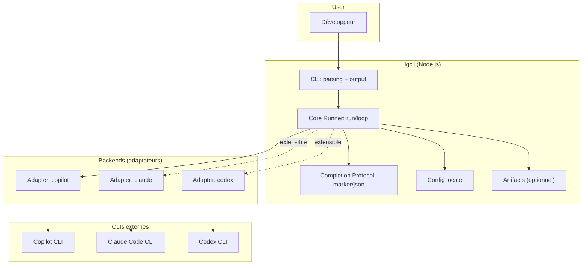

# Décisions d'Architecture (ADR) — `@jlguenego/ai-cli` (CLI : `jlgcli`)

## Contexte architectural

`jlgcli` est un orchestrateur **local** (Windows-first) qui pilote des **CLIs IA externes** (Copilot CLI, Claude Code CLI, Codex CLI, …) via des adaptateurs.

### Vue d'ensemble (OBLIGATOIRE)

---

## Registre des décisions

### ADR-001 : Langage d'implémentation (TypeScript vs JavaScript)

| Attribut  | Valeur                     |
| --------- | -------------------------- |
| Date      | 2026-01-25                 |
| Statut    | Proposé                    |
| Décideurs | Mainteneur + contributeurs |

#### Contexte

Le projet doit être publié sur NPM, exécutable en CLI, et rester robuste (parsing, IO, process management, cross-platform).

#### Options considérées

| Option                      | Avantages                                           | Inconvénients                                          |
| --------------------------- | --------------------------------------------------- | ------------------------------------------------------ |
| A) JavaScript (ESM/CJS)     | Simplicité, pas de build TS                         | Moins de garanties, refactors plus risqués             |
| B) TypeScript (build -> JS) | Types, DX, fiabilité, API d'adaptateurs plus stable | Chaîne de build, config TS, release un peu plus lourde |

#### Décision

**Option retenue (proposée)** : **B) TypeScript** (compilé en JS pour NPM).

#### Conséquences

- **Positives** : contrats d’adaptateurs plus sûrs, moins de regressions sur le runner/loop.
- **Négatives** : pipeline build (tsc) + bundling éventuel.
- **Risques** : friction contributions si TS mal configuré.

---

### ADR-002 : Librairie de parsing CLI

| Attribut  | Valeur     |
| --------- | ---------- |
| Date      | 2026-01-25 |
| Statut    | Proposé    |
| Décideurs | Mainteneur |

#### Contexte

La CLI doit exposer plusieurs commandes (`backends`, `config`, `run`, `loop`) et des options cohérentes (`--json`, `--backend`, `--timeout`, etc.).

#### Options considérées

| Option          | Avantages                           | Inconvénients                                  |
| --------------- | ----------------------------------- | ---------------------------------------------- |
| A) commander    | Très répandu, ergonomique, bon help | Certaines limites sur types/validation avancée |
| B) yargs        | Validation/usage puissants          | API plus verbeuse                              |
| C) parse maison | Aucun lock-in                       | Risque de bugs, coût maintenance               |

#### Décision

**Option retenue (proposée)** : **A) commander**.

#### Conséquences

- **Positives** : implémentation rapide, usage standard.
- **Négatives** : quelques validations devront être custom.

---

### ADR-003 : Exécution des backends (process spawning)

| Attribut  | Valeur     |
| --------- | ---------- |
| Date      | 2026-01-25 |
| Statut    | Proposé    |
| Décideurs | Mainteneur |

#### Contexte

Les backends sont des binaires externes, dont la sortie doit être streamée proprement et dont les erreurs/timeouts doivent être normalisés.

#### Options considérées

| Option                          | Avantages                                                | Inconvénients                                 |
| ------------------------------- | -------------------------------------------------------- | --------------------------------------------- |
| A) `child_process.spawn` (Node) | Dépendance zéro, contrôle fin                            | Quoting Windows, gestion erreurs plus “brute” |
| B) `execa`                      | API high-level, meilleure DX, gestion stdout/stderr/exit | Dépendance tierce                             |

#### Décision

**Option retenue (proposée)** : **B) `execa`**, en imposant une discipline stricte sur les arguments (éviter le shell, passer argv).

#### Conséquences

- **Positives** : robustesse cross-platform, gestion timeouts plus simple.
- **Négatives** : dépendance à maintenir.

---

### ADR-004 : Emplacement de configuration

| Attribut  | Valeur     |
| --------- | ---------- |
| Date      | 2026-01-25 |
| Statut    | Proposé    |
| Décideurs | Mainteneur |

#### Contexte

Le brief demande une **config locale persistée** et une compatibilité Windows.

#### Options considérées

| Option                                      | Avantages                                | Inconvénients                        |
| ------------------------------------------- | ---------------------------------------- | ------------------------------------ |
| A) Dans le repo (ex: `.jlgcli/config.json`) | Simple à inspecter, portable avec projet | Pollue repo, multi-projets difficile |
| B) Par utilisateur (AppData/XDG)            | Standard, multi-projets                  | Moins visible, gestion override      |
| C) Les deux (merge)                         | Flexible                                 | Complexité, règles de priorité       |

#### Décision

**Option retenue (proposée)** : **C) Les deux**.

Ordre de priorité recommandé :

1. options CLI (override)
2. config projet (si présente)
3. config utilisateur
4. defaults

#### Conséquences

- **Positives** : bon équilibre UX (portable + global).
- **Négatives** : logique de merge à documenter.

---

### ADR-005 : Protocole de complétion (marker vs JSON)

| Attribut  | Valeur     |
| --------- | ---------- |
| Date      | 2026-01-25 |
| Statut    | Proposé    |
| Décideurs | Mainteneur |

#### Contexte

Le runner `loop` a besoin d’un signal robuste et parseable pour décider `continue|done|error`.

#### Options considérées

| Option                                 | Avantages                                 | Inconvénients                                            |
| -------------------------------------- | ----------------------------------------- | -------------------------------------------------------- |
| A) Marker (`DONE` en dernière ligne)   | Très simple                               | Fragile si le backend “oublie” ou ajoute du texte        |
| B) JSON final (`{"status":"done"...}`) | Parseable, extensible (`summary`, `next`) | Fragile si JSON invalide, nécessite consignes au backend |

#### Décision

**Option retenue (proposée)** : **supporter A + B**, avec **B par défaut** (recommandé) et fallback `continue` si parsing JSON échoue.

#### Conséquences

- **Positives** : meilleure automatisation en CI.
- **Négatives** : nécessite une “discipline de prompt” (templates).

---

### ADR-006 : Artifacts de run

| Attribut  | Valeur     |
| --------- | ---------- |
| Date      | 2026-01-25 |
| Statut    | Proposé    |
| Décideurs | Mainteneur |

#### Contexte

Le brief évoque la traçabilité et la reprise/restart possible.

#### Options considérées

| Option                                 | Avantages                   | Inconvénients                        |
| -------------------------------------- | --------------------------- | ------------------------------------ |
| A) Pas d’artefacts (stdout uniquement) | Minimal                     | Debug difficile, pas de reprise      |
| B) Artefacts opt-in (`--artifacts`)    | Traçabilité, audit, support | Stockage disque, gestion PII/secrets |

#### Décision

**Option retenue (proposée)** : **B) opt-in**.

Format recommandé : `.jlgcli/runs/<runId>/` contenant :

- `meta.json` (backend, options, timings)
- `transcript.ndjson` (événements stdout/stderr)
- `result.json` (résumé final, status)

#### Conséquences

- **Positives** : reproductibilité et troubleshooting.
- **Négatives** : nécessité de **redaction** (voir ADR-008).

---

### ADR-007 : Architecture des adaptateurs (extensibilité)

| Attribut  | Valeur     |
| --------- | ---------- |
| Date      | 2026-01-25 |
| Statut    | Proposé    |
| Décideurs | Mainteneur |

#### Contexte

Le produit doit supporter plusieurs backends (au moins 1 au départ) avec une API unifiée.

#### Options considérées

| Option                               | Avantages                     | Inconvénients                |
| ------------------------------------ | ----------------------------- | ---------------------------- |
| A) Adaptateurs “in-tree” (bundle)    | Simplicité, qualité contrôlée | Moins extensible par tiers   |
| B) Plugins externes (dynamic import) | Extensible, communauté        | Sécurité, compat, versioning |

#### Décision

**Option retenue (proposée)** : **A d’abord**, avec une **interface stable** qui permettra **B** plus tard.

Interface minimale suggérée :

- `id: string`
- `isAvailable(): Promise<{status: 'available'|'missing'|'unauthenticated', details?: string}>`
- `runOnce(args): Promise<{ exitCode: number, text: string, raw?: unknown }>`

#### Conséquences

- **Positives** : MVP plus rapide.
- **Négatives** : ajout d’un backend = release du package.

---

### ADR-008 : Sécurité et gestion des secrets (logs & artefacts)

| Attribut  | Valeur     |
| --------- | ---------- |
| Date      | 2026-01-25 |
| Statut    | Proposé    |
| Décideurs | Mainteneur |

#### Contexte

Les CLIs IA utilisent des tokens (env vars) et peuvent afficher des infos sensibles. Le projet doit éviter de persister des secrets accidentellement.

#### Options considérées

| Option                                      | Avantages        | Inconvénients           |
| ------------------------------------------- | ---------------- | ----------------------- |
| A) Ne rien filtrer                          | Simple           | Risque élevé de fuite   |
| B) Redaction best-effort + opt-in artifacts | Réduit le risque | Faux négatifs possibles |

#### Décision

**Option retenue (proposée)** : **B**.

Mesures minimales :

- ne jamais sérialiser `process.env` dans `meta.json`
- redaction best-effort sur sorties persistées (patterns token/secret courants)
- documentation claire “ne collez pas de secrets dans les prompts”

#### Conséquences

- **Positives** : meilleure sécurité par défaut.
- **Négatives** : redaction imparfaite ; besoin d’avertissements UX.

---

## Principes architecturaux

| Principe            | Description                                                   | Rationale               |
| ------------------- | ------------------------------------------------------------- | ----------------------- |
| Windows-first       | Pas d’hypothèse POSIX (paths, quoting, encodage)              | Contrainte du brief     |
| Sans shell          | Passer argv à `spawn/execa` sans `shell=true`                 | Robustesse + sécurité   |
| Runner déterministe | Garde-fous stricts (`timeout`, `maxIterations`, `noProgress`) | Éviter boucles infinies |
| Output dual         | Humain + `--json` stable                                      | Scripting/CI            |
| Artefacts opt-in    | Traçabilité sans surprise                                     | Privacy + disque        |

## Contraintes

| Contrainte        | Impact                      | Source |
| ----------------- | --------------------------- | ------ |
| Runtime Node.js   | Implémentation JS/TS        | Brief  |
| NPM publishable   | Packaging, build, bin       | Brief  |
| Backends externes | Détection, erreurs, auth    | Brief  |
| Multi-OS souhaité | Tests/quoting/path handling | Brief  |
