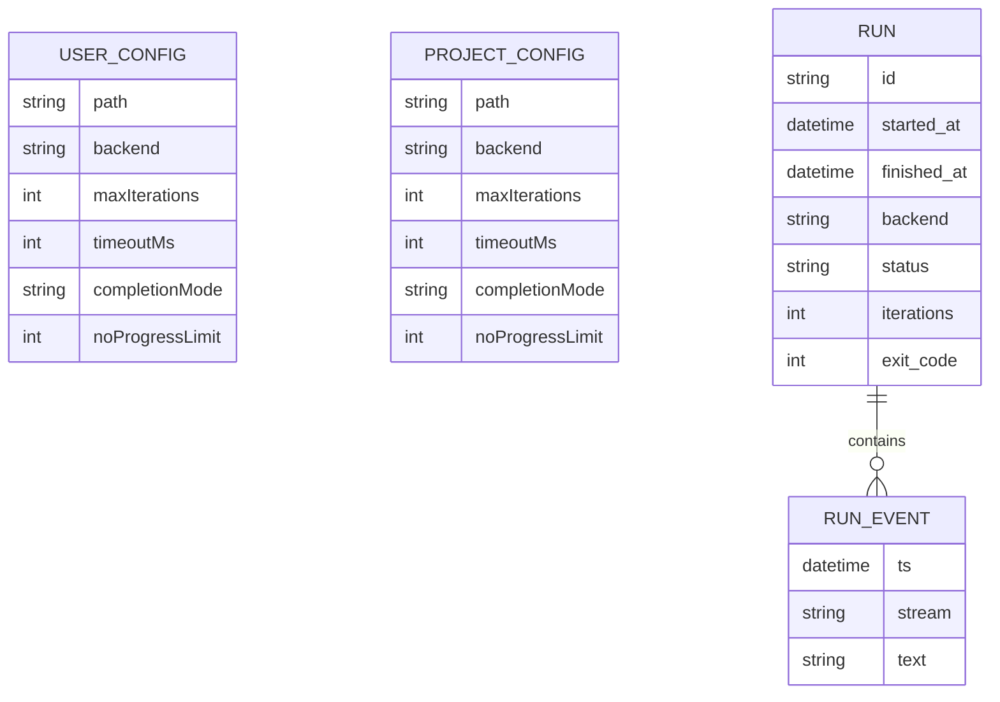

# Spécifications Techniques — `@jlguenego/ai-cli` (CLI : `jlgcli`)

## Stack technique

| Couche            | Technologie          | Version | Justification                                            |
| ----------------- | -------------------- | ------- | -------------------------------------------------------- |
| CLI               | Node.js              | >= 20   | Runtime ciblé, support Windows, écosystème riche         |
| Langage           | TypeScript           | ^5.x    | ADR-001 : fiabilité + contrats adaptateurs               |
| Parsing CLI       | commander            | ^12.x   | ADR-002 : ergonomie + standards                          |
| Exécution process | execa                | ^9.x    | ADR-003 : spawn robuste, timeout, cross-platform         |
| Logs              | pino                 | 1       | Logs structurés + séparation stdout/stderr (mode `json`) |
| Tests             | vitest               | 1       | Tests unitaires/integ runner/adapters                    |
| CI                | GitHub Actions       | 1       | Matrice Windows + macOS + Linux                          |
| Stockage config   | JSON (user + projet) | 1       | Simple, diffable, portable                               |
| Artifacts         | NDJSON + JSON        | 1       | Transcript streamable + résumé parseable                 |

---

## Architecture technique (OBLIGATOIRE)

```mermaid
graph TB
  subgraph User
    U[Développeur]
  end

  subgraph Host[Machine locale]
    subgraph App[jlgcli (Node.js)]
      CMD[Command Parser]
      CFG[Config Loader]
      RUN[Runner: run/loop]
      CP[Completion Parser]
      OUT[Output: humain/--json]
      ART[Artifacts Writer]

      CMD --> CFG --> RUN --> CP --> OUT
      RUN --> ART
    end

    subgraph Backends
      AD1[Adapter Copilot]
      AD2[Adapter Codex]
      AD3[Adapter Claude (hors MVP)]
    end

    subgraph ExternalCLIs[CLIs externes]
      COP[copilot]
      COD[codex]
      CLA[claude]
    end

    RUN --> AD1
    RUN --> AD2
    RUN -. extensible .-> AD3

    AD1 --> COP
    AD2 --> COD
    AD3 --> CLA
  end

  U --> CMD
```

---

## Modèle de données

> Le produit n’expose pas de “base de données” au sens classique ; il manipule surtout de la **configuration** et des **artefacts** sur disque.

### Entités principales



### Dictionnaire de données

| Entité         | Champ           | Type   | Contraintes                                                        | Description                                 |
| -------------- | --------------- | ------ | ------------------------------------------------------------------ | ------------------------------------------- |
| USER_CONFIG    | backend         | string | ∈ backends supportés                                               | Backend par défaut utilisateur              |
| USER_CONFIG    | maxIterations   | int    | >0                                                                 | Limite max d’itérations pour `loop`         |
| USER_CONFIG    | timeoutMs       | int    | >0                                                                 | Timeout global pour `loop`                  |
| USER_CONFIG    | completionMode  | string | marker\|json                                                       | Protocole de complétion                     |
| USER_CONFIG    | noProgressLimit | int    | >=0                                                                | Arrêt si répétitions                        |
| PROJECT_CONFIG | \*              | \*     | idem                                                               | Overrides au niveau projet                  |
| RUN            | id              | string | unique                                                             | Identifiant de run (`YYYYMMDD-HHMMSS-rand`) |
| RUN            | status          | string | done\|error\|timeout\|max-iterations\|backend-missing\|no-progress | Cause d’arrêt normalisée                    |
| RUN_EVENT      | stream          | string | stdout\|stderr                                                     | Canal d’événement                           |
| RUN_EVENT      | text            | string | non vide                                                           | Chunk texte streamé                         |

---

## Spécifications API

> Ici “API” = **API interne** (modules/contrats TS) + **interface CLI**.

### Endpoints (commandes CLI)

| Commande                          | Description              | Auth              |
| --------------------------------- | ------------------------ | ----------------- |
| `jlgcli backends`                 | Liste backends + statuts | N/A               |
| `jlgcli config get/set/show/path` | Lecture/écriture config  | N/A               |
| `jlgcli run <prompt>`             | Exécution one-shot       | Backend dépendant |
| `jlgcli loop <prompt>`            | Exécution itérative      | Backend dépendant |

### Contrats d'API (internes)

#### `Adapter` (contrat minimal)

```json
{
  "id": "copilot",
  "isAvailable": "() => { status: 'available'|'missing'|'unauthenticated'|'unsupported', details?: string }",
  "runOnce": "({ prompt, cwd, env, timeoutMs? }) => { exitCode: number, text: string, raw?: any }"
}
```

#### `CompletionParser`

- Mode `marker` : `DONE` si et seulement si une **dernière ligne exactement** `DONE`.
- Mode `json` : extraire le **dernier objet JSON valide** de la sortie et valider un schéma minimal `{ status, summary?, next? }`.
  - Si aucun JSON valide n’est trouvé (ou schéma invalide) : arrêt en erreur **invalid-json** (recommandation : `EX_DATAERR = 65`).

---

## Intégrations externes

| Système                    | Type      | Protocole            | Authentification               |
| -------------------------- | --------- | -------------------- | ------------------------------ |
| GitHub Copilot CLI         | CLI local | process spawn (argv) | Login Copilot côté utilisateur |
| Codex CLI                  | CLI local | process spawn (argv) | Login/clé côté utilisateur     |
| Claude Code CLI (hors MVP) | CLI local | process spawn (argv) | Login/clé côté utilisateur     |

---

## Exigences non-fonctionnelles

| Catégorie     | Exigence                                                            | Cible                      |
| ------------- | ------------------------------------------------------------------- | -------------------------- |
| Performance   | `backends` doit être rapide (pas de requêtes longues)               | < 1s typique               |
| Performance   | Streaming : afficher les chunks au fil de l’eau                     | sans buffering perceptible |
| Fiabilité     | `loop` stoppé par `maxIterations` / `timeoutMs` / `noProgressLimit` | toujours                   |
| Portabilité   | Windows + macOS + Linux (MVP)                                       | oui                        |
| Sécurité      | Ne pas persister `process.env` dans les artefacts                   | obligatoire                |
| Sécurité      | Redaction best-effort sur transcript persisté                       | recommandé                 |
| Observabilité | Résumé final clair + `--json` stable                                | obligatoire                |
