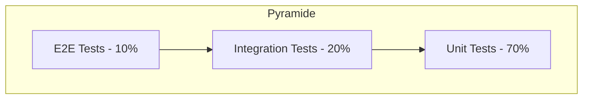

# Stratégie de Tests & Vérification — `@jlguenego/ai-cli` (CLI : `jlgcli`)

## Pyramide des tests



---

## Tests unitaires

### Couverture cible

| Module | Cible | Critique |
| ------ | ----- | -------- |
| Completion parser (`marker/json`) | 95% | Oui |
| Runner (`loop` stop conditions) | 90% | Oui |
| Config (merge/priorité) | 85% | Oui |
| Utils (redaction/similarity/fs safe path) | 85% | Non |
| Adapters (parsing sortie, mapping codes) | 80% | Oui |

### Structure des tests

```typescript
describe("[Module/Fonction]", () => {
  describe("[Méthode]", () => {
    it("should [comportement attendu] when [condition]", () => {
      // Arrange
      // Act
      // Assert
    });
  });
});
```

### Conventions de nommage

- Fichiers : `*.test.ts` ou `*.spec.ts`
- Descriptions : `should <verbe> when <condition>`

---

## Tests d'intégration

### Scénarios critiques

| ID | Scénario | Composants impliqués | Priorité |
| --- | -------- | -------------------- | -------- |
| INT-001 | `backends` retourne statuts cohérents | CLI + adapters (`isAvailable`) | Haute |
| INT-002 | `run` exécute et stream stdout | CLI + adapter + runner | Haute |
| INT-003 | `loop` s’arrête sur `DONE` (marker strict) | runner + completion | Haute |
| INT-004 | `loop` s’arrête sur `{status:"done"}` (json) | runner + completion | Haute |
| INT-005 | `loop` timeout → code 3 | runner + timeout | Haute |
| INT-006 | `loop` maxIterations → code 4 | runner | Haute |
| INT-007 | `--artifacts` écrit dossier + fichiers | runner + fs | Moyenne |

### Configuration environnement test

- Utiliser des **adapters fake** (binaires simulés) pour rendre les tests déterministes.
- Variante : un “backend mock” Node (`node ./tests/fixtures/mock-backend.js`) qui :
  - imprime des chunks,
  - peut terminer par `DONE`, ou JSON, ou boucler.

---

## Tests E2E

> Ici E2E = exécuter la CLI comme un utilisateur (process). On ne dépend pas d’un vrai Copilot/Claude en CI (trop instable).

### Parcours critiques à couvrir (OBLIGATOIRE)

```mermaid
flowchart LR
  A[jlgcli backends] --> B[Afficher statuts]
  B --> C[jlgcli loop "..." --max-iterations 3]
  C --> D[Résumé final + exit code]
```

| ID | Parcours | Steps | Priorité |
| --- | ------- | ----- | -------- |
| E2E-001 | Smoke `--help` / `--version` | exécuter binaires, vérifier exit 0 | Haute |
| E2E-002 | Loop marker | run backend mock, vérifier arrêt `DONE` | Haute |
| E2E-003 | Loop json | run backend mock, vérifier arrêt `status=done` | Haute |

---

## Tests de performance

| Test | Outil | Métrique | Seuil |
| ---- | ---- | -------- | ----- |
| `backends` | chrono | durée | < 1s (typique) |
| `loop` (mock) | chrono | overhead runner | faible vs backend |

---

## Tests de sécurité

| Type | Outil | Fréquence |
| ---- | ---- | --------- |
| SAST | ESLint + (optionnel) CodeQL | Chaque PR |
| Dependency scan | npm audit / Dependabot | Régulier |

Focus :
- pas de `shell: true`
- redaction best-effort si artifacts activés
- ne jamais persister `process.env`

---

## Critères de validation

### Definition of Done

- [ ] Tests unitaires écrits et passants
- [ ] Couverture > seuil défini (au moins sur modules critiques)
- [ ] Pas de régression
- [ ] Review effectuée
- [ ] Documentation mise à jour

### Critères d'acceptance automatisés

| Story | Critère | Test automatisé |
| ----- | ------- | --------------- |
| US-003 | Statut backends affiché | INT-001 / E2E-001 |
| US-004 | `run` stream + exit code | INT-002 |
| US-005 | `loop` stop `DONE` | INT-003 / E2E-002 |
| US-010 | `loop` stop JSON | INT-004 / E2E-003 |
| US-006 | timeout/maxIterations | INT-005/INT-006 |
| US-008 | artifacts écrits | INT-007 |
