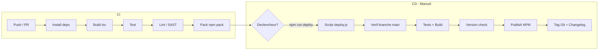

# Intégration & Déploiement — `@jlguenego/ai-cli` (CLI : `jlgcli`)

Ce projet est un **package NPM** (CLI) : le "déploiement" vise surtout la **CI**, la **publication NPM**, et des releases reproductibles.

## Pipeline CI/CD (OBLIGATOIRE)



---

## Environnements

| Environnement | URL            | Déploiement               | Usage           |
| ------------- | -------------- | ------------------------- | --------------- |
| Development   | local          | Manuel                    | dev/itérations  |
| CI            | GitHub Actions | Automatique               | build/test/lint |
| Release       | NPM registry   | Manuel (`npm run deploy`) | distribution    |

---

## Configuration par environnement

| Variable       | Dev    | CI                  | Release          |
| -------------- | ------ | ------------------- | ---------------- |
| `NODE_VERSION` | 20+    | 20+                 | 20+              |
| `NPM_TOKEN`    | absent | secret (si publish) | `~/.npmrc` local |
| `LOG_LEVEL`    | debug  | info                | info             |

Notes CI :

- exécuter la CI sur une matrice OS **Windows + macOS + Linux** (ex: `windows-latest`, `macos-latest`, `ubuntu-latest`).

Notes sécurité :

- ne jamais écrire les tokens dans les logs
- authentification NPM via `~/.npmrc` local (déjà configuré)

---

## Script de déploiement Node.js

> Référence : Clarification [009-deploy-npmjs](../clarifications/009-deploy-npmjs-normalized.md)

### Architecture

```
project/
├── scripts/
│   └── deploy.js          # Script principal de déploiement (Node.js)
├── package.json           # Script "deploy" ajouté
└── CHANGELOG.md           # Généré automatiquement
```

### Stratégie de versioning

**Semantic-release** basé sur les conventional commits :

| Type de commit     | Impact version | Exemple                          |
| ------------------ | -------------- | -------------------------------- |
| `fix:`             | Patch (1.0.x)  | `fix(cli): handle empty prompt`  |
| `feat:`            | Minor (1.x.0)  | `feat(loop): add max iterations` |
| `BREAKING CHANGE:` | Major (x.0.0)  | `feat!: remove deprecated API`   |

### Étapes du script `deploy.js`

| #   | Étape                | Description                         | Bloquant |
| --- | -------------------- | ----------------------------------- | -------- |
| 1   | Vérification branche | Autoriser uniquement `main`         | ✅       |
| 2   | Exécution tests      | `npm test`                          | ✅       |
| 3   | Build TypeScript     | `npm run build`                     | ✅       |
| 4   | Vérification version | Non déjà publiée sur npm            | ✅       |
| 5   | Dry-run optionnel    | `--dry-run` flag                    | ❌       |
| 6   | Publication npm      | `npm publish --access public`       | ✅       |
| 7   | Tag Git              | `git tag vX.Y.Z && git push --tags` | ✅       |
| 8   | Changelog            | Mise à jour `CHANGELOG.md`          | ✅       |

### Commandes disponibles

```bash
# Publication complète
npm run deploy

# Dry-run (simulation sans publication)
npm run deploy -- --dry-run

# Exécution directe
node scripts/deploy.js [--dry-run]
```

---

## Procédures de déploiement

### Déploiement standard (publication NPM)

1. S'assurer d'être sur la branche `main` à jour
2. Vérifier que la CI est verte
3. Bumper version selon conventional commits (`npm version patch|minor|major`)
4. Exécuter `npm run deploy`
5. Le script :
   - Vérifie la branche
   - Exécute les tests
   - Build le projet
   - Vérifie que la version n'existe pas sur npm
   - Publie sur npm (`@jlguenego/ai-cli`)
   - Crée un tag Git
   - Met à jour le CHANGELOG.md

### Rollback

1. Identifier la dernière version stable `vX.Y.Z`
2. Republier une correction `vX.Y.(Z+1)` (préféré)
3. En cas d'urgence, déprécier la version fautive sur NPM (`npm deprecate`)

---

## Infrastructure as Code

Non applicable au MVP : pas de service déployé. Si une infra apparaît plus tard (ex: serveur d'orchestration), alors :

- définir `infrastructure/` (terraform)
- et environnements `staging/production`

---

## Checklist de release

### Pré-release

- [ ] Branche `main` à jour
- [ ] Tests passants (unit + integration)
- [ ] `npm pack` OK (contenu du package validé)
- [ ] `README.md` à jour (install, usage, troubleshooting)
- [ ] Version bump effectuée (conventional commits)
- [ ] Changelog/notes de release rédigés

### Post-release

- [ ] `npm install -g @jlguenego/ai-cli@<version>` fonctionne
- [ ] `jlgcli --version` OK
- [ ] Smoke `jlgcli backends` OK (au moins sur environnement de dev)
- [ ] Tag Git créé et poussé
- [ ] CHANGELOG.md mis à jour
- [ ] Annonce/communication (si nécessaire)
