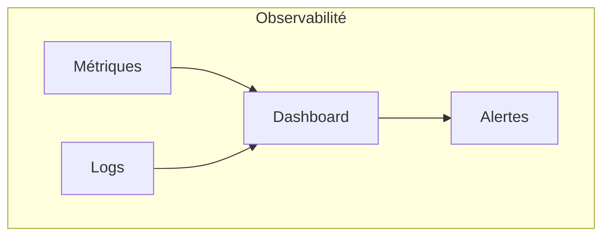

# Maintenance & Exploitation — `@jlguenego/ai-cli` (CLI : `jlgcli`)

Le produit est un **CLI local** (pas un service long-running) : la maintenance concerne surtout la fiabilité, la sécurité (secrets/logs), la compatibilité OS, et les releases.

## Monitoring

### Métriques clés (OBLIGATOIRE)

> Les “métriques” peuvent être produites via `--json` (sortie machine-readable) et/ou par logs structurés.



| Métrique                                 | Source             | Seuil alerte | Seuil critique |
| ---------------------------------------- | ------------------ | ------------ | -------------- |
| Taux d’échec de runs                     | CI (tests) / usage | > 5%         | > 10%          |
| Timeout rate (`exit=75`)                 | `--json` agrégé    | > 5%         | > 10%          |
| Max-iterations rate (`exit=4`)           | `--json` agrégé    | > 5%         | > 10%          |
| Backend-missing rate (`exit=2`)          | `--json` agrégé    | > 10%        | > 20%          |
| Backend-unauthenticated rate (`exit=6`)  | `--json` agrégé    | > 10%        | > 20%          |
| No-progress rate (`exit=5`)              | `--json` agrégé    | > 5%         | > 10%          |
| Invalid-json rate (`exit=65`)            | `--json` agrégé    | > 1%         | > 2%           |
| Artifacts-write-failure rate (`exit=73`) | `--json` agrégé    | > 1%         | > 2%           |
| Durée médiane d’un `loop` (mock)         | CI perf basique    | dérive       | dérive forte   |

### Stack monitoring

| Composant                 | Outil                                        |
| ------------------------- | -------------------------------------------- |
| Logs CI                   | GitHub Actions logs                          |
| Metrics usage (optionnel) | scripts internes (pas télémétrie par défaut) |
| Alerting release          | GitHub Actions + notifications               |

---

## SLAs / SLOs

> Pas de SLA “service”. SLO interne pour qualité release.

| Service       | SLO                                      | Mesure              |
| ------------- | ---------------------------------------- | ------------------- |
| CLI           | 0 régression bloquante sur commandes MVP | CI + smoke tests    |
| Compatibility | Windows-first (paths/quoting)            | matrice CI multi-OS |

---

## Runbooks

### RUN-001 : Publication NPM échoue

| Attribut         | Valeur     |
| ---------------- | ---------- |
| Sévérité         | P2         |
| Temps de réponse | 30-60 min  |
| Escalade         | Mainteneur |

#### Symptômes

- Job CI “publish” rouge
- `npm publish` échoue (auth, version, permissions)

#### Diagnostic

1. Vérifier secrets (`NPM_TOKEN`) et permissions du workflow
2. Vérifier que la version n’est pas déjà publiée
3. Vérifier les fichiers inclus (`npm pack --dry-run`)

#### Résolution

- Corriger token/permissions
- Bumper version si collision
- Relancer pipeline

#### Post-mortem

- [ ] Root cause documentée
- [ ] Ajout d’un guard (ex: check version) si nécessaire

---

## Procédures de maintenance

### Maintenance planifiée

| Type                        | Fréquence   | Fenêtre      | Notification |
| --------------------------- | ----------- | ------------ | ------------ |
| Updates sécurité deps       | Mensuel     | à la demande | via PR       |
| Revue compat Windows        | Mensuel     | à la demande | via PR       |
| Revue UX CLI (help/erreurs) | Trimestriel | à la demande | via issues   |

### Backups

Non applicable (pas de base). Pour les artefacts locaux :

- l’utilisateur peut supprimer `.jlgcli/runs/` à tout moment
- aucune garantie de rétention

---

## Gestion des incidents

### Processus

```mermaid
flowchart TD
  A[Issue / Bug report] --> B[Triage]
  B --> C{Sévérité?}
  C -->|P1| D[Hotfix]
  C -->|P2| E[Sprint / prochaine release]
  C -->|P3| F[Backlog]
  D --> G[Release]
  E --> G
  G --> H[Post-mortem (si P1/P2)]
```

### Contacts d'escalade

| Niveau | Contact            | Délai    |
| ------ | ------------------ | -------- |
| L1     | Mainteneur         | Immédiat |
| L2     | Contributeurs clés | < 24h    |

---

## Documentation opérationnelle

- [ ] Runbooks à jour
- [ ] Changelog et notes de release
- [ ] Politique de secrets (ne pas logguer / redaction)
- [ ] Matrice CI multi-OS documentée
